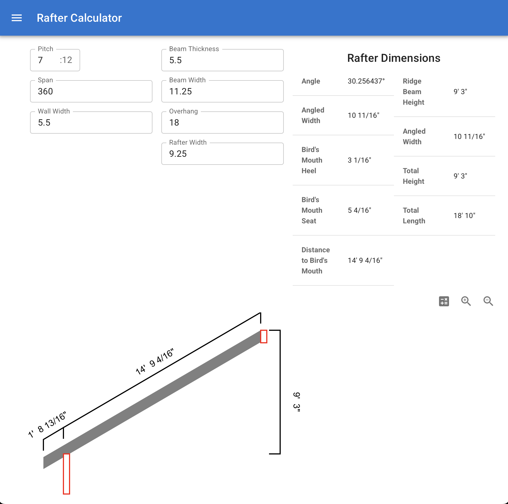

# Rafters 2D

A Rafter calculator using:
- Tauri and React.
- [Material UI](https://mui.com/material-ui/)
- [Zustand](https://zustand.docs.pmnd.rs/getting-started/introduction)
- [Konva](https://konvajs.org/)
- [pythagoras](https://github.com/dskyberg/pythagoras) (See below)

 

I also created a helper lib of right angle utility functions in rust, call [pythagoras](https://github.com/dskyberg/pythagoras).  Be sure to clone the help library locally before building Rafters 2D.

 

 

